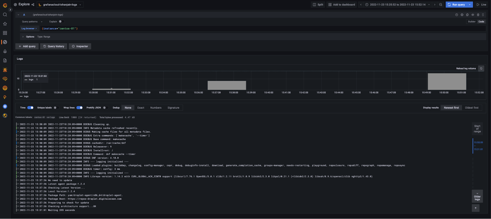
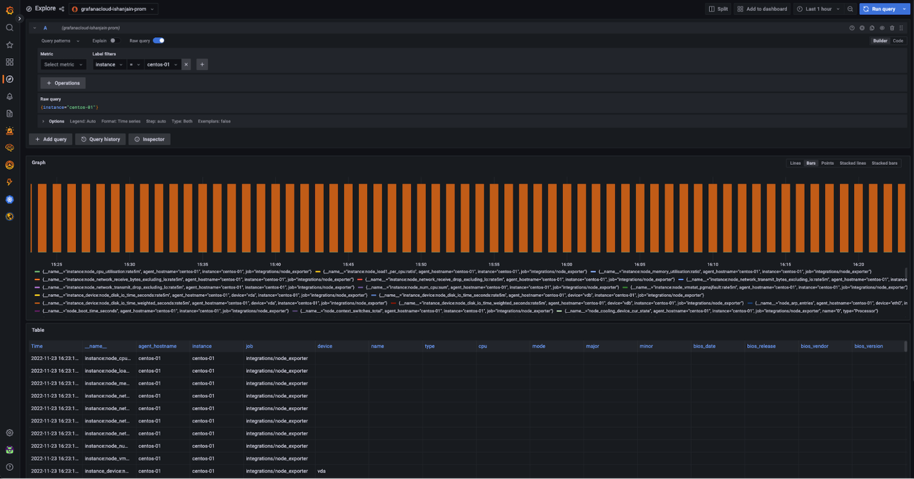
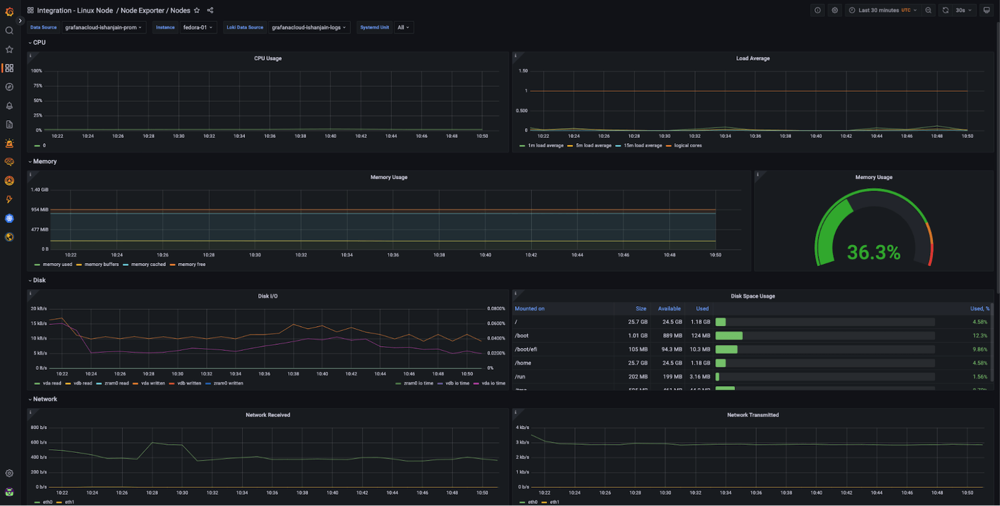

# grafana-ansible-role-monitor-multiple-linux-hosts

# 🚀 Monitoring multiple Linux hosts with Grafana Agent Role 🚀

https://github.com/coding-to-music/grafana-ansible-role-monitor-multiple-linux-hosts

From / By https://grafana.com/docs/grafana-cloud/developer-resources/infrastructure-as-code/ansible/ansible-multiple-agents/

# Monitoring multiple Linux hosts with Grafana Agent Role

Monitoring with Grafana Agents across multiple Linux hosts can be difficult. To make it easier, you can use the Grafana Agent role with the Grafana Ansible collection.

https://github.com/grafana/grafana-ansible-collection

## GitHub

```java
git init
git add .
git remote remove origin
git commit -m "first commit"
git branch -M main
git remote add origin git@github.com:coding-to-music/grafana-ansible-role-monitor-multiple-linux-hosts.git
git push -u origin main
```

## Before you begin

Before you begin, you should have:

- Linux hosts
- SSH access to the Linux hosts
- Account permissions sufficient to install and use Grafana Agent on the Linux hosts
- An Access Policy Token

## Generate token

Use a Grafana.com access policy token

Token name

Enter a descriptive name to identify this token.

```java
default-token-name-here
```

Create token

## Install the Grafana Ansible collection

The Grafana Agent role is available in the Grafana Ansible collection as of the 1.1.0 release.

https://github.com/grafana/grafana-ansible-collection/tree/main/roles/grafana_agent

To install the Grafana Ansible collection, run this command:

```java
ansible-galaxy collection install grafana.grafana:1.1.1
```

## Create an Ansible inventory file

Next, you will set up your hosts and create an inventory file.

Create your hosts and add public SSH keys to them.
This example uses eight Linux hosts: two Ubuntu hosts, two CentOS hosts, two Fedora hosts, and two Debian hosts.

Create an Ansible inventory file.
The Ansible inventory, which resides in a file named inventory, looks similar to this:

```java
146.190.208.216 # hostname = ubuntu-01
146.190.208.190 # hostname = ubuntu-02
137.184.155.128 # hostname = centos-01
146.190.216.129 # hostname = centos-02
198.199.82.174 # hostname = debian-01
198.199.77.93 # hostname = debian-02
143.198.182.156 # hostname = fedora-01
143.244.174.246 # hostname = fedora-02
```

Note: If you are copying the above file, remove the comments (#).

Create an ansible.cfg file within the same directory as inventory, with the following values:

```java
[defaults]
inventory = inventory # Path to the inventory file
private_key_file = ~/.ssh/id_rsa # Path to my private SSH Key
remote_user=root
```

## Install the Linux Node integration for Grafana Cloud

Next you will create an Ansible playbook that calls the grafana_agent role from the grafana.grafana Ansible collection.

To use the Grafana Agent Ansible role:

Create a file named deploy-agent.yml in the same directory as ansible.cfg and inventory and add the configuration below.

```yml
- name: Install Grafana Agent
  hosts: all
  become: true

  vars:
    grafana_cloud_api_key: <Your Cloud Access Policy token> # Example - glc_eyJrIjoiYjI3NjI5MGQxZTcyOTIxYTc0MDgzMGVhNDhlODNhYzA5OTk2Y2U5YiIsIm4iOiJhbnNpYmxldGVzdCIsImlkIjo2NTI5
    metrics_username: <prometheus-username> # Example - 825019
    logs_username: <loki-username> # Example - 411478
    prometheus_url: <prometheus-push-url> # Example - https://prometheus-us-central1.grafana.net/api/prom/push
    loki_url: <loki-push-url> # Example - https://logs-prod-017.grafana.net/loki/api/v1/push
  tasks:
    - name: Install Grafana Agent
      ansible.builtin.include_role:
        name: grafana.grafana.grafana_agent
      vars:
        grafana_agent_metrics_config:
          configs:
            - name: integrations
              remote_write:
                - basic_auth:
                    password: "{{ grafana_cloud_api_key }}"
                    username: "{{ metrics_username }}"
                  url: "{{ prometheus_url }}"

          global:
            scrape_interval: 60s
          wal_directory: /tmp/grafana-agent-wal
        grafana_agent_logs_config:
          configs:
            - name: default
              clients:
                - basic_auth:
                    password: "{{ grafana_cloud_api_key }}"
                    username: "{{ logs_username }}"
                  url: "{{ loki_url }}"
              positions:
                filename: /tmp/positions.yaml
              target_config:
                sync_period: 10s
              scrape_configs:
                - job_name: varlogs
                  static_configs:
                    - targets: [localhost]
                      labels:
                        instance: ${HOSTNAME:-default}
                        job: varlogs
                        __path__: /var/log/*log
        grafana_agent_integrations_config:
          node_exporter:
            enabled: true
            instance: ${HOSTNAME:-default}
          prometheus_remote_write:
            - basic_auth:
                password: "{{ grafana_cloud_api_key }}"
                username: "{{ metrics_username }}"
              url: "{{ prometheus_url }}"
        grafana_agent_env_vars:
          HOSTNAME: "%H"
```

The playbook calls the grafana_agent role from the grafana.grafana Ansible collection.

The Agent configuration in this playbook send metrics and logs from the linux hosts to Grafana Cloud along with the hostname of each instance

Refer to the Grafana Ansible documentation↗ to understand the other variables you can pass to the grafana_agent role.

https://github.com/grafana/grafana-ansible-collection/tree/main/roles/grafana_agent#role-variables

When deploying the Agent across multiple instances for monitoring them, It is essential that the Agent is able to auto-detect the hostname for ease in monitoring. Notice that the label instance has been set to the value {$HOSTNAME:-default}, which is substituted by the value of the HOSTNAME environment variable in the Linux host.

To read more about the variable substitution, refer to the Grafana Agent node_exporter_config↗ documentation.

https://grafana.com/docs/agent/latest/static/configuration/integrations/node-exporter-config/

To run the playbook, run this command:

```java
ansible-playbook deploy-agent.yml
```

Note: You can place the deploy-agent.yml, ansible.cfg and inventory files in different directories based on your needs.

## Check that logs and metrics are being ingested into Grafana Cloud

Logs and metrics will soon be available in Grafana Cloud. To test this, use the Explore feature. Click the Explore icon (compass icon) in the vertical navigation bar.

### Check logs

To check logs:

- Use the dropdown menu at the top of the page to select your Loki logs data source.
- In the log browser, run the query {instance=“centos-01“} where centos-01 is the hostname of one of the Linux hosts.
  If you see log lines (shown in the example below), logs are being received.



Received Logs

If no log lines appear, logs are not being collected.

### Check metrics

To check metrics:

Use the dropdown menu at the top of the page to select your Prometheus data source.
Run the query {instance=“centos-01“} where centos-01 is the hostname of one of the Linux hosts.
If you see a metrics graph and table (shown in the example below), metrics are being received.

metrics view



Received Metrics

If no metrics appear, metrics are not being collected.

### View dashboards

Now that you have logs and metrics in Grafana, you can use dashboards to view them. Here‘s an example of one of the prebuilt dashboards included with the Linux integration:

dashboard



Using the Instance dropdown in the dashboard, you can select from the hostnames where you deployed Grafana Agent and start monitoring them.
